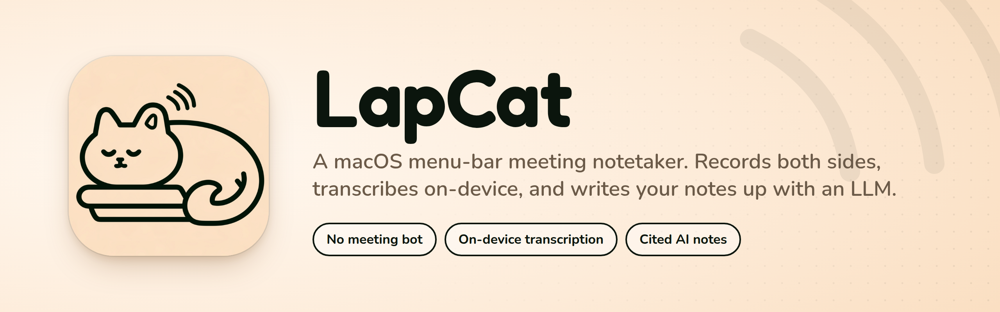
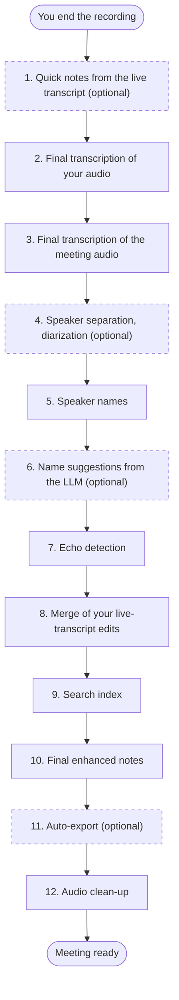

<p align="center">
  
</p>

<h1 align="center">LapCat</h1>

<p align="center">
  <a href="https://github.com/mlg87/lapcat/actions/workflows/ci.yml"></a>
  <a href="https://github.com/mlg87/lapcat/releases/latest"></a>
</p>

<p align="center">
  <a href="#install-a-release-build">Install</a> ·
  <a href="#quick-start">Quick start</a> ·
  <a href="#features">Features</a> ·
  <a href="#settings-reference">Settings</a> ·
  <a href="#build-from-source">Build from source</a>
</p>

LapCat is a meeting notetaker for the macOS menu bar. It records your microphone ("Me") and the audio of the meeting app ("Them") as two channels. No bot joins the meeting. LapCat transcribes the audio on your Mac. Then it uses a large language model (LLM) to make enhanced notes from your notes and the transcript.

The product requirements are in [docs/product-requirements/lapcat-mvp-prd.md](docs/product-requirements/lapcat-mvp-prd.md).

## At a glance

| Area | What LapCat does |
| --- | --- |
| [Meeting detection](#meeting-detection) | Asks "Record …?" when Zoom or a browser uses the microphone, or when a calendar meeting starts. |
| [While you record](#while-you-record) | Shows a Markdown editor for your notes next to the live transcript. |
| [After the meeting](#after-the-meeting) | Makes the final transcript, names the speakers and writes enhanced notes. |
| [Enhanced notes](#enhanced-notes) | Uses templates and cites the transcript in each AI bullet. |
| [Transcript](#transcript) | Lets you edit lines, rename speakers and play the kept audio from a timestamp. |
| [Chat and recipes](#chat-and-recipes) | Answers questions about one meeting or many meetings. |
| [Organize and search](#organize-and-search) | Gives you full-text search, folders, tags, stars and filters. |
| [Export](#export) | Copies or exports notes and transcripts. Writes each meeting to an export folder if you set one. |
| [LLM providers](#llm-providers) | Uses the Claude CLI, the Claude API or a local model. |
| [Transcription](#transcription) | Transcribes on your Mac with Whisper or Parakeet. |
| [Audio](#audio) | Records the microphone and the meeting audio, with echo cancellation and retention rules. |
| [Speakers](#speakers) | Reads speaker names from Zoom and Google Meet. |

## Contents

- [At a glance](#at-a-glance)
- [Requirements](#requirements)
- [Install a release build](#install-a-release-build)
- [Permissions](#permissions)
- [Quick start](#quick-start)
- [Features](#features)
- [Settings reference](#settings-reference)
- [Data on disk](#data-on-disk)
- [Platform notes](#platform-notes)
- [Build from source](#build-from-source)
- [Contributing](#contributing)
- [Privacy](#privacy)
- [License](#license)

## Requirements

- macOS 14.2 or later.
- A Mac with Apple Silicon or an Intel processor. The release app is a Universal 2 binary.
- The permissions in [Permissions](#permissions).
- For enhanced notes and chat, one of these LLM providers:
  - The Claude command-line tool (`claude`), signed in.
  - An Anthropic API key.
  - Approximately 2.5 GB of disk space for the local model (Qwen3 4B).

## Install a release build

1. Open the [Releases page](https://github.com/mlg87/lapcat/releases).
2. Download `LapCat-vX.Y.Z-universal.zip` from the latest release.
3. Unzip the file.
4. Move `LapCat.app` to `/Applications`.
5. Right-click `LapCat.app`.
6. Select **Open**.
7. In the dialog, select **Open** again.
8. Grant the permissions that LapCat asks for.

> [!IMPORTANT]
> The app has a signature from a self-signed development certificate ("LapCat Dev"). Apple did not notarize the app. Thus macOS blocks a double-click when you open the app the first time. Steps 5 to 7 are necessary one time only.

## Permissions

When LapCat starts the first time, it shows the permissions checklist. To show the checklist again, select **Permissions…** in the menu-bar menu. You can also use **Settings → General → Show permissions checklist…**. Each row has a **Grant** button and an **Open System Settings** button.

| Permission | Necessary? | Use |
| --- | --- | --- |
| Microphone | Yes | Records your voice as the "Me" channel. |
| System Audio Recording | Yes | Records the audio of the meeting app as the "Them" channel. The setting is in System Settings → Privacy & Security → Screen & System Audio Recording. |
| Calendars | No | Gives titles to meetings and lists the attendees. LapCat only reads the calendar. |
| Notifications | No | Shows the "Record …?" prompt when a meeting starts. The menu-bar menu also shows the prompt. |
| Automation (browser) | No | Reads the current browser tab to find Google Meet calls. This signal is off by default. |
| Accessibility | No | Reads Zoom and Google Meet participant names to label speakers. You must enable LapCat in System Settings → Privacy & Security → Accessibility. |
| Screen Recording | No | LapCat uses it only as a fallback when the system audio tap fails. |


> [!WARNING]
> You must grant the Accessibility permission manually. Enable LapCat in System Settings → Privacy & Security → Accessibility. LapCat uses this permission to read Zoom and Google Meet participant names.

## Quick start

These global shortcuts work in all apps. You can change each shortcut in **Settings → General**.

| Shortcut | Action |
| --- | --- |
| <kbd>⌃</kbd><kbd>⌥</kbd><kbd>N</kbd> | Start a new note and start the recording. |
| <kbd>⌃</kbd><kbd>⌥</kbd><kbd>P</kbd> | Pause or resume the recording. |
| <kbd>⌃</kbd><kbd>⌥</kbd><kbd>E</kbd> | End the recording. |
| <kbd>⌃</kbd><kbd>⌥</kbd><kbd>L</kbd> | Open the LapCat window. |

The menu-bar menu has these items:

- A status line: "Not recording", "Starting…", "Recording", "Paused" or "Finishing…".
- **Record "…"?** and **Not now** when LapCat detects a meeting.
- **New Note** when LapCat does not record. **Pause** or **Resume** and **End** during a recording.
- **Open LapCat**.
- **Ask across meetings…**.
- **Permissions…**.
- **Settings…** (<kbd>⌘</kbd><kbd>,</kbd>).
- **Quit LapCat** (<kbd>⌘</kbd><kbd>Q</kbd>).

During a recording, the menu-bar icon changes to a record symbol and shows the elapsed time.

To record a meeting:

1. Press <kbd>⌃</kbd><kbd>⌥</kbd><kbd>N</kbd>.
2. Type your notes in Markdown on the left side of the window.
3. Read the live transcript on the right side.
4. Press <kbd>⌃</kbd><kbd>⌥</kbd><kbd>E</kbd> when the meeting ends.
5. Read the enhanced notes in the **Enhanced** tab.

## Features

### Meeting detection

- LapCat shows a "Record …?" prompt when one of these signals occurs:
  - Zoom or a browser in the list starts to use the microphone.
  - A calendar event with a Zoom or Google Meet link starts.
  - The current browser tab is a Google Meet call. This signal is optional and off by default.
- The default app list is Zoom (`us.zoom.xos`), Chrome, Safari, Arc, Edge, Brave and Firefox. You can change the list in **Settings → Detection**.
- LapCat never records without your click.
- **Not now** stops prompts from that app process for 10 minutes.
- A session that starts from a prompt stops automatically. This occurs when the meeting app does not use the microphone for 60 seconds. A session that you start manually never stops automatically.

### While you record

- The left pane is a Markdown editor for your notes. LapCat saves the notes 1 second after your last keystroke.
- The right pane shows the live transcript. "Them" bubbles are on the left. "Me" bubbles are on the right. Speaker names show when LapCat knows them.
- Use the **Live transcript** button to show or hide the transcript pane.
- Use **Pause** and **Resume** to stop and continue the recording.
- A banner reminds you to tell the participants about the recording. **Copy disclosure** copies a message to the clipboard. You can change the message in **Settings → General**.

### After the meeting

When you end a recording, LapCat processes the meeting in these steps:



Dashed boxes are optional steps.

<details>
<summary>The steps in detail</summary>

1. Quick notes: a first version of the enhanced notes from the live transcript.
2. Final transcription of your audio, with the high-quality model.
3. Final transcription of the meeting audio.
4. Speaker separation (diarization) of the meeting audio.
5. Speaker names. The sources are the channel ("Me"), the names that Zoom or Meet shows, and the calendar attendees.
6. Name suggestions from the LLM. In the **Transcript** tab, use the `Confirm` or `Dismiss` button for each suggestion.
7. Echo detection. LapCat marks your microphone lines that repeat the meeting audio.
8. A merge of your live-transcript edits into the final transcript.
9. The search index.
10. The final enhanced notes.
11. Auto-export, if you set an export folder.
12. Audio clean-up, if **Keep recordings** is **Never**.

</details>

The status badge in the meeting header shows the current step. If a necessary step fails, a banner shows the error and a **Retry processing** button. Steps 1, 4, 6 and 11 are optional. If one of them fails, processing continues. After a crash, LapCat resumes processing at the step that stopped.

### Enhanced notes

- A template controls the structure of the enhanced notes. LapCat has 6 built-in templates:
  - General meeting
  - 1:1
  - Standup
  - Customer call
  - Interview
  - Project review
- With the **Automatic** template, the LLM selects a template for each meeting.
- To add a custom template, save a Markdown file in `~/Library/Application Support/LapCat/templates/`. The file starts with front matter (`name:` and `description:`). Then it has `##` sections with `<!-- instructions -->`.
- Each AI bullet cites the transcript with `[[s:ID]]`. Click a citation to show the cited line in the transcript.
- Your own lines and AI lines have different text colors.
- Use **Enhance** or **Re-enhance** to make new notes with a different template. Use **With provider** to select a different LLM provider.
- Each enhance adds a new version. The **Version** menu shows the earlier versions.
- **Copy as Markdown** copies the notes.

### Transcript

- Each paragraph shows a timestamp, the speaker and the channel icon.
- If LapCat kept the audio, click a timestamp to play the audio from that point.
- Click a speaker name to rename the speaker, merge two speakers, or assign a paragraph to a different speaker.
- Double-click a line to edit it. A pencil icon shows the original text.
- **Find** (<kbd>⌘</kbd><kbd>F</kbd>) searches the transcript. <kbd>⌘</kbd><kbd>G</kbd> and <kbd>⇧</kbd><kbd>⌘</kbd><kbd>G</kbd> go to the next and previous match.
- **Jump to time** accepts `hh:mm:ss`, `mm:ss` or seconds.
- **Show echo duplicates** shows the lines that echo detection marked.
- **Copy** copies all paragraphs or the selected paragraphs, with speaker labels.
- **Delete Audio Now…** deletes the recording. The transcript and the notes stay.

### Chat and recipes

- The **Chat** tab of a meeting answers questions about that meeting.
- **Ask across meetings…** in the menu-bar menu answers questions about many meetings. The scope is all meetings, one folder, or a date range.
- Answers cite segments as `[[s:ID]]` in the same meeting and as `[[m:MEETING_ID#s:ID]]` in a different meeting.
- Type `/` in the chat field to use a recipe. The built-in recipes are:

| Recipe | Result |
| --- | --- |
| `/follow-up` | A follow-up email with decisions, action items and open questions, in fewer than 200 words. |
| `/actions` | All action items, grouped by owner. |
| `/decisions` | The decisions, with the person who decided and the reason. |
| `/questions` | The open questions and the person who must answer each one. |
| `/mine` | All the tasks that you agreed to do, with dates. |

You can add custom recipes in **Settings → Recipes**.

### Organize and search

- The search field in the sidebar searches notes, enhanced notes, transcripts, titles and participants.
- Folders have one level. Drag meetings onto a folder to move them. When you delete a folder, its meetings stay and have no folder.
- Add tags as a comma-separated list in the meeting header.
- Use the star button to mark a meeting.
- The filter button filters the list by folder, star, date and participant name. The date options are Any time, Today, Last 7 days, Last 30 days and Custom range.
- To delete a meeting, right-click it in the list and select **Delete Meeting…**. You can also press <kbd>Delete</kbd>, or use the **More** (⋯) menu in the meeting header.
- LapCat deletes the notes, the enhanced notes, the transcript, the chat and the audio of the meeting. You cannot undo the deletion. Files in your export folder stay.
- You cannot delete a meeting while LapCat records or processes it.

### Export

The **Export** menu in the meeting header has these items:

- **Copy Notes as Markdown**.
- **Copy as Plain Text**.
- **Export Meeting (.md)…**: YAML front matter, the enhanced notes, your notes and the transcript in one file.
- **Export Transcript…**: Markdown (`.md`), plain text (`.txt`), SubRip (`.srt`) or WebVTT (`.vtt`).

If you set a folder in **Settings → Export**, LapCat writes `YYYY-MM-DD Title.md` there after the final notes of each meeting are ready. A new export of the same meeting replaces the old file.

### LLM providers

LapCat tries the providers in this order. If a provider is not available, LapCat uses the next one.

1. Claude via CLI: the `claude` command-line tool that you signed in to.
2. Claude API: an Anthropic API key. LapCat keeps the key in the macOS Keychain.
3. Local: Qwen3 4B through the bundled `llama-server`.

- You can change the order in **Settings → AI**.
- Each provider has a model for each task (enhance, chat, classify). See [AI](#ai) for the defaults.
- The **Test** button sends a short request to the provider.
- **Offline only** uses only the local model. It also stops all model downloads.

### Transcription

- **Settings → Transcription** has three engine options: Automatic, Whisper and Parakeet.
- Automatic uses Parakeet on Apple Silicon. LapCat downloads the Parakeet model on first use.
- Whisper models download on demand to `~/Library/Application Support/LapCat/models/`:

| Model | Size |
| --- | --- |
| `ggml-base.en.bin` | 148 MB |
| `ggml-small.en.bin` | 488 MB |
| `ggml-large-v3-turbo-q5_0.bin` | 574 MB |

- An option shows in-progress text while a person speaks. LapCat transcribes the current utterance again every 2 seconds. This option uses more CPU.

### Audio

- Select the microphone input device in **Settings → Audio**.
- Echo cancellation cancels the remote voices that your microphone records from the speakers. Without echo cancellation, use headphones.
- The capture scope is the meeting app only, or all system audio except LapCat.
- **Keep recordings** controls how long LapCat keeps audio: Never, 7 days, 30 days or Forever.

### Speakers

- LapCat can read speaker names from Zoom and Google Meet through the Accessibility permission. Keep the Meet tab visible for the best result.
- Without names, LapCat labels speakers "Speaker 1", "Speaker 2" and so on. You can rename them.
- **Settings → Speakers** has editable selector JSON for Zoom and Meet, with **Save**, **Revert** and **Restore built-in**.


## Settings reference

Open the settings with **Settings…** in the menu-bar menu or with <kbd>⌘</kbd><kbd>,</kbd>.

Each tab has a table. Click a summary line to show the table.

### General

<details>
<summary><b>General</b> settings</summary>

| Control | Default | Effect |
| --- | --- | --- |
| `Display name` | Your macOS full name | The name for your own ("Me") lines in transcripts and notes. |
| Global shortcuts | <kbd>⌃</kbd><kbd>⌥</kbd><kbd>N</kbd>, <kbd>⌃</kbd><kbd>⌥</kbd><kbd>P</kbd>, <kbd>⌃</kbd><kbd>⌥</kbd><kbd>E</kbd>, <kbd>⌃</kbd><kbd>⌥</kbd><kbd>L</kbd> | Click a shortcut. Then type a new key combination with one modifier or more. <kbd>Esc</kbd> cancels. |
| Remind me to tell participants when a recording starts | On | Shows the consent banner during a recording. |
| Disclosure message | "Heads up: I'm taking AI notes for this meeting with a local app on my Mac. Tell me if you'd rather I didn't." | The text that **Copy disclosure** copies. |
| Restore default message | — | Sets the default disclosure message again. |
| Show permissions checklist… | — | Opens the permissions window. |

</details>

### Audio

<details>
<summary><b>Audio</b> settings</summary>

| Control | Default | Effect |
| --- | --- | --- |
| Input device | System default | The microphone for the "Me" channel. **Refresh devices** reads the device list again. |
| Echo cancellation (voice processing) | On | Cancels the remote voices that your microphone records from the speakers. Without it, remote voices can show as your own lines. |
| Capture | Meeting app only | The source of the "Them" channel. The other option is "All system audio except LapCat". |
| Keep recordings | 30 days | Never, 7 days, 30 days or Forever. The setting applies to future meetings. "Never" deletes audio after the final transcript. |

</details>

### Transcription

<details>
<summary><b>Transcription</b> settings</summary>

| Control | Default | Effect |
| --- | --- | --- |
| Engine | Automatic | Automatic, Whisper or Parakeet. Intel Macs always use Whisper. |
| Show in-progress text while someone is speaking | On (Apple Silicon), Off (Intel) | Shows text before an utterance is complete. |
| Live transcript | `ggml-small.en.bin` | The Whisper model for the live transcript. |
| Final transcript (after the meeting) | `ggml-large-v3-turbo-q5_0.bin` (Apple Silicon), `ggml-small.en.bin` (Intel) | The Whisper model for the final transcript. |
| Downloads | — | Downloads each Whisper model and shows its status. |

</details>

### AI

<details>
<summary><b>AI</b> settings</summary>

| Control | Default | Effect |
| --- | --- | --- |
| Providers | Claude via CLI, Claude API, Local | Drag to change the order. **Test** sends a short request to a provider. |
| `Offline only (local model; no network)` | Off | Uses only the local model and stops model downloads. |
| Models | See the next table | The model for each provider and task. |
| Claude API key | Empty | **Save** keeps the key in the Keychain. The `Remove` button deletes the key. |
| Claude CLI path | Empty | The path to `claude`. When empty, LapCat looks in `~/.local/bin`, `/usr/local/bin` and `/opt/homebrew/bin`. |
| Local model | Qwen3 4B (Q4_K_M) | Downloads the model file for the Local provider (approximately 2.5 GB). |

</details>

Default models:

<details>
<summary><b>AI</b> default models</summary>

| Provider | Enhance | Chat | Classify |
| --- | --- | --- | --- |
| Claude via CLI | `sonnet` | `sonnet` | `haiku` |
| Claude API | `claude-haiku-4-5` | `claude-sonnet-5-5` | `claude-haiku-4-5` |
| Local | `Qwen3-4B-Q4_K_M.gguf` | `Qwen3-4B-Q4_K_M.gguf` | `Qwen3-4B-Q4_K_M.gguf` |

</details>

### Speakers

<details>
<summary><b>Speakers</b> settings</summary>

| Control | Default | Effect |
| --- | --- | --- |
| Read speaker names from Zoom and Google Meet | On | Uses the Accessibility permission to name speakers. |
| Advanced: Zoom selectors (JSON) | Built-in selectors | **Save** accepts only valid JSON. **Revert** discards your edits. **Restore built-in** deletes your custom selectors. |
| Advanced: Google Meet selectors (JSON) | Built-in selectors | The same controls as the Zoom selectors. |

</details>

### Detection

<details>
<summary><b>Detection</b> settings</summary>

| Control | Default | Effect |
| --- | --- | --- |
| Ask to record when a meeting starts | On | Enables the meeting prompts. |
| Apps that trigger a prompt when they use the microphone | 7 bundle IDs | Zoom and six browsers. Use the `Add`, `Remove` and `Restore defaults` buttons to change the list. |
| Prompt when a calendar event with a Zoom/Meet link starts | On | Uses the calendar as a signal. |
| Prompt when the browser's current tab is a Google Meet call | Off | Needs the Automation permission for your browser. |
| Calendar | — | Shows the access status, with **Grant calendar access** and **Open System Settings**. |

</details>

### Templates

<details>
<summary><b>Templates</b> settings</summary>

| Control | Default | Effect |
| --- | --- | --- |
| Default template | Automatic (LapCat picks per meeting) | The template for new enhanced notes. |
| Templates | 6 built-in templates | Lists the built-in and custom templates. **Show** shows a custom file in Finder. |
| Open templates folder | — | Opens `~/Library/Application Support/LapCat/templates/`. |
| Rescan | — | Reads the templates folder again. |

</details>

### Recipes

<details>
<summary><b>Recipes</b> settings</summary>

| Control | Default | Effect |
| --- | --- | --- |
| Built-in | 5 recipes | You can read the built-in recipes. You cannot edit them. |
| Custom | None | **Add recipe…**, **Edit** and **Delete**. Each recipe has a name, a slash command and a prompt. |

</details>

### Export

<details>
<summary><b>Export</b> settings</summary>

| Control | Default | Effect |
| --- | --- | --- |
| Folder | Off | The folder for automatic Markdown exports. |
| Choose folder… | — | Selects the folder. |
| Show in Finder | — | Opens the folder. |
| Turn off | — | Stops the automatic export. |

</details>

If the folder does not exist, LapCat skips the export.

## Data on disk

LapCat keeps all data in `~/Library/Application Support/LapCat/`:

| Path | Content |
| --- | --- |
| `lapcat.sqlite` | The SQLite database (WAL mode): meetings, notes, transcripts, chats and the search index. |
| `audio/<meeting>/mic.aac` | Your microphone audio, ADTS AAC. A file stays playable after a crash. |
| `audio/<meeting>/them.aac` | The meeting audio, ADTS AAC. |
| `models/` | Downloaded Whisper and LLM models. |
| `templates/` | Your custom templates. |

Audio retention:

- When a recording ends, LapCat sets a delete date from the **Keep recordings** setting.
- LapCat deletes expired audio when it starts and every 6 hours.
- With **Never**, LapCat deletes the audio after the final transcript.
- **Delete Audio Now…** in the **Transcript** tab deletes the audio of one meeting.


## Platform notes

> [!NOTE]
> Intel Macs transcribe with whisper.cpp. The live and final model is `small.en`. Parakeet (FluidAudio, Core ML) crashes on x86_64. Thus LapCat never selects Parakeet on Intel.

- Apple Silicon Macs use Parakeet by default.
- Speaker names come from the accessibility trees of Zoom and Meet. To see what an app shows, run `swift run lapcat-dev axdump us.zoom.xos`.

## Build from source

Requirements:

- macOS 14.2 or later.
- Swift 6.2. The Command Line Tools are sufficient. Xcode is optional.

The project is one SwiftPM package. There is no `.xcodeproj` file.

```bash
scripts/make-dev-cert.sh        # once: self-signed "LapCat Dev" identity in its own keychain
scripts/fetch-sidecars.sh       # once: llama-server binaries for the local LLM (vendor/)
scripts/dev.sh                  # build build/LapCat.app (debug), sign it, run it in the foreground
scripts/test.sh                 # run the test suites (use this, not bare `swift test`)
scripts/bundle-app.sh release   # Universal 2 (arm64 + x86_64) app bundle in build/LapCat.app
swift run lapcat-dev            # developer CLI: prints the command list
swift scripts/make-icons.swift  # regenerate AppIcon.icns and the menu-bar glyph from docs/design/app-icon/
```

### Why the app runs only from the signed bundle

macOS keeps privacy grants (microphone, system audio, accessibility) for the signature of the bundle. The stable "LapCat Dev" identity keeps the grants after each rebuild. To sign with a different identity, set `LAPCAT_CODESIGN_IDENTITY`.

### Why `scripts/test.sh` exists

The Command Line Tools keep `Testing.framework` out of the default search path. Thus a bare `swift test` builds but runs zero tests. `scripts/test.sh` adds the necessary flags. With Xcode selected, the script does not add the flags.

### Package layout

<details>
<summary>Seven modules</summary>

| Module | Content |
| --- | --- |
| `LapCatCore` | GRDB store, settings, permissions, export, citations, templates and recipes. |
| `LapCatAudio` | Process tap, microphone capture, ScreenCaptureKit fallback, voice activity detection, input detection. |
| `LapCatSpeech` | whisper.cpp, Parakeet, diarization, speaker naming, echo detection, model downloads. |
| `LapCatLLM` | LLM providers, router, enhancer, chat. |
| `LapCatSpeakers` | Accessibility adapters for Zoom and Google Meet. |
| `LapCatApp` | The SwiftUI menu-bar app. |
| `lapcat-dev` | The developer CLI. |

</details>

### Developer CLI

Run `swift run lapcat-dev <command>`. Without a command, the CLI prints the command list.

<details>
<summary>Commands and arguments</summary>

| Command | Arguments | Result |
| --- | --- | --- |
| `--version` | — | Prints the version and the whisper.cpp system information. |
| `stt-bench` | `--engine whisper\|parakeet [--model <file>] [--version v2\|v3] [--live-only\|--file-only] <audio-file>` | Prints the real-time factor and the transcript. |
| `tap-probe` | `<bundle-id>\|--system <seconds> <out-dir> [--voice-processing]` | Records the microphone and system audio. Prints the RMS for each second and the file formats. |
| `llm-probe` | `claude-cli\|anthropic-api\|local [--model M] [--gguf PATH] [--stream] "prompt"` | Sends one request to an LLM provider. Prints the raw and parsed reply. |
| `diarize-bench` | `<audio-file>` | Prints the diarization time and the speaker turns. |
| `axdump` | `<bundle-id> [--depth 12] [--interval 0.5] [--count N] [--timeout 0.5] [--observe [selectors.json]]` | Prints the accessibility tree of an app. `--observe` prints the speaker observations of the Zoom or Meet adapter. |
| `enhance-demo` | `[--template ID] [--model M]` | Enhances a sample meeting through the Claude CLI. |
| `templates` | — | Lists the built-in templates and their resource bundle. |
| `detect-watch` | `[bundle-id…\|*]` | Prints microphone activity of meeting apps until you press <kbd>Ctrl</kbd><kbd>C</kbd>. Without arguments, it watches the default app list. `*` watches all processes. |

</details>

`llm-probe anthropic-api` reads the key from the `ANTHROPIC_API_KEY` environment variable.

### Environment variables

| Variable | Effect |
| --- | --- |
| `LAPCAT_CODESIGN_IDENTITY` | The signing identity for `scripts/bundle-app.sh`. The default is "LapCat Dev". |

## Contributing

Read [AGENTS.md](AGENTS.md) before you start. It defines the conventions for worktrees, pull request titles, checks and releases.

- Make all changes in a linked git worktree, on a branch named `<type>/<short-name>`.
- `main` accepts only squash-merged pull requests.
- The pull request title is a Conventional Commit: `type(scope): description`.
- These checks must pass: `lint`, `typecheck`, `build`, `test` and `pr-title`.
- The `ci` workflow runs `lint`, `build` and `test` on `macos-26`. It runs `typecheck` on Ubuntu.

Before you push, run these commands:

```bash
swift format lint --strict --recursive Sources Tests Package.swift scripts/make-icons.swift
npx tsc -p tsconfig.json
scripts/test.sh
```

To correct the format, run this command:

```bash
swift format format -i --recursive Sources Tests Package.swift scripts/make-icons.swift
```

### Releases

1. release-please opens a release pull request, `chore(main): release X.Y.Z`.
2. A maintainer merges the release pull request.
3. release-please tags `vX.Y.Z` and publishes a GitHub Release with the changelog section.
4. The `release-assets` workflow attaches `LapCat-vX.Y.Z-universal.zip` to the release.


> [!CAUTION]
> Do not edit `CHANGELOG.md` manually. release-please writes it.

The first release is v0.1.0.

## Privacy

> [!TIP]
> To keep all text on your Mac, select the Local provider. To stop all model downloads, turn on **Offline only**.

- LapCat records only after you start a note or click a prompt.
- Audio stays on your Mac. LapCat transcribes it on your Mac.
- LapCat sends transcript text and notes to the LLM provider that you select. With the Local provider, the text stays on your Mac.
- LapCat downloads models from the internet. **Offline only** stops these downloads.

## License

License: not yet chosen.
